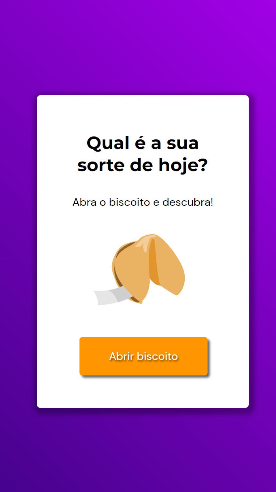
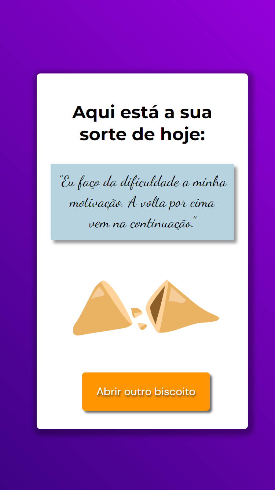

# Biscoito da Sorte | Programa Explorer da Rocketseat
Desafio Extra Rocketseat | Stage 05

- Jogo "Biscoito da Sorte", no qual o usuário a partir de um clique, abre um biscoito com a sua sorte do dia.

 

 
- 🔗[Clique aqui para acessar](https://alineviana.github.io/biscoito-da-sorte/)

 

## 📝 Conceitos estudados

- Estrutura de dados HTML
- Animações com CSS
- Funções no Javascript
- Manipulação da DOM
- Biblioteca JS Math()
- Funções *callback*
- Arrays

 

## 🖥️ Tecnologias

- HTML5
- CSS3
- JavaScript

